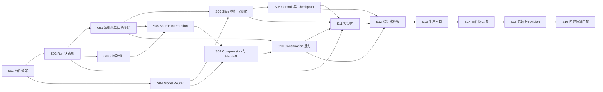

# Auto Slice 实现切片计划

本计划把 [`auto-slice-design.md`](auto-slice-design.md) 转换为可逐片交付的实现契约。术语以 [`CONTEXT.md`](../CONTEXT.md) 为准，架构取舍以 [`docs/adr`](adr/) 为准；任何实现不得在切片内部改写这些已冻结决策。

当前目录尚不是 Git 仓库。进入 S01 前必须创建实际项目骨架、初始化 Git，并固定构建、类型检查、测试和 lint 命令；计划中的逻辑路径可在 S01 映射为所选技术栈的真实路径，但模块边界和端口语义不得改变。

## 1. 全局切片契约

每个实现切片必须物化为一份 `SliceSpec`，不得只依赖聊天上下文：

```text
SliceSpec {
  id: SliceId
  contract_version: 1
  requires: SliceId[]
  objective: string
  exclusions: string[]
  inputs: ArtifactRef[]
  owned_paths: RepoRelativePath[]
  ports: PortContract[]
  allowed_transitions: Transition[]
  failure_codes: ErrorCode[]
  checks: CheckSpec[]
  expected_artifacts: ArtifactSpec[]
  unlocks: SliceId[]
}

ArtifactRef {
  path
  digest
  producer_slice | "frozen-design"
}

CheckSpec {
  id
  argv: string[]              # 禁止拼接 shell 字符串
  cwd: RepoRelativePath
  timeout_ms
  env_allowlist: string[]
  expected_exit_code
  expected_artifacts[]
}
```

切片执行协议固定为：

```text
BLOCKED -> READY -> IN_PROGRESS -> VERIFYING -> COMPLETE
                                  \-> FAILED
```

- `BLOCKED -> READY`：所有 `requires` 均有可验证的 `CompletionReceipt`，输入 digest 与磁盘一致。
- `READY -> IN_PROGRESS`：声明 owned paths，确认 Protected Change 无重叠，记录起始 HEAD 与工作区摘要。
- `IN_PROGRESS -> VERIFYING`：预期产物齐全，未触达 exclusions 和未拥有路径。
- `VERIFYING -> COMPLETE`：所有确定性 checks 通过并写出 `CompletionReceipt`。
- `VERIFYING -> FAILED`：保存失败回执，禁止解锁后继切片；修复仍属于当前切片，不新开“补丁切片”。

```text
CompletionReceipt {
  slice_id
  contract_digest
  input_digests[]
  output_digests[]
  touched_paths[]
  check_receipts[] {
    check_id
    argv
    exit_code
    stdout_digest
    stderr_digest
    duration_ms
  }
  start_head
  end_head | null
  owned_diff_digest
  completed_at
}
```

### Definition of Ready

- 前置切片全部 `COMPLETE`，不存在跳号执行；
- 冻结设计、ADR、术语表和输入产物 digest 可读取；
- owned paths 与其他在途切片不重叠；
- 基线测试全绿；若尚无测试框架，S01 必须先建立；
- 需要真实外部能力时，其 contract fixture、测试仓库或本地适配器已就绪；
- 不携带未解析术语、未决设计标记或未登记的错误码进入实现。

### Definition of Done

- objective 完成且 exclusions 零触达；
- 新分支、新错误闭合和恢复路径均有最小测试；
- 单元测试可隔离纯逻辑，但文件系统、进程、Git、锁和 Handoff 完整性必须有真实集成测试，不能只靠 mock；
- 编译或类型检查、测试、lint、契约校验全部返回预期退出码；
- 文档中的端口、状态和错误码与实现一致；
- 生成 `CompletionReceipt`，并在 `docs/代码链路.md` 追加精确到文件和符号的记录；
- 若采用 `after_slice`，只提交 owned changes；若采用 `none`，记录 owned diff digest；永不 push。

### 跨切片不变量

1. 同一时刻只有一个切片可以修改生产代码。
2. Controller 的状态转换、外部副作用意图和副作用回执都必须持久化。
3. `state_version` CAS 失败不得重放外部副作用。
4. Source Thread、Compression Task、Continuation Task 的 UUID 必须两两不同。
5. Compression Task 永远没有 Project Write Lease。
6. Handoff 未验证前不得授予 Continuation Task 写权限。
7. 同一 `compaction_id` 最多创建一个 Compression Task。
8. Protected Change 无法证明归属时按用户改动处理，禁止自动提交。
9. 所有失败均进入枚举状态；日志文本和模型自述不是状态证据。
10. 测试 runner、Git、文件摘要和工具回执负责判定对错，LLM 不得自验收。
11. Controller 必须是 Content-blind Controller；Worker Content 不得进入模型上下文、控制判断、持久状态、回执或日志。

## 2. 依赖图与交付顺序



允许并行准备但不允许并行写入生产路径：S02 与 S04 在 S01 后可分别实现；S03 与 S07 在 S02 后可分别实现。合流切片开始前必须消费所有前置 `CompletionReceipt`。S13 是后续已冻结的生产入口扩展，以 [`contracts/slices/S13.json`](../contracts/slices/S13.json) 和 S13 `CompletionReceipt` 为权威输入。

## 3. S01 插件骨架与契约装载

**Requires**：无。

**Objective**：建立可加载的 Codex 本地插件、Controller 进程入口、项目级测试命令和冻结契约装载器。

**Exclusions**：不持久化 Run，不创建 Codex 任务，不执行 Git 提交，不选择具体状态数据库。

**Inputs**：`CONTEXT.md`、`docs/auto-slice-design.md`、四条 ADR、插件清单规范。

**Owned outputs**：`.codex-plugin/plugin.json`、Controller 启动入口、`contracts/` 只读模型、测试配置、基础 lint/typecheck 配置。

**Port contract**：

```text
load_frozen_contracts(workspace_root) -> FrozenContracts | ContractLoadError

FrozenContracts {
  schema_version
  context_digest
  design_digest
  adr_digests[]
  workspace_identity {
    canonical_root
    filesystem_identity
  }
}
```

路径必须先 canonicalize；符号链接、Windows 大小写差异和相对路径不得产生两个 workspace identity。契约装载只读，不自动修正文档。

**Failure closure**：缺文件、重复插件 ID、schema 不支持或路径无法定址时返回 `contract_load_failed`，进程可报告状态但不得进入 `PREPARING`。

**Deterministic checks**：

- 插件 manifest schema 校验；
- 同一路径的不同拼写得到相同 workspace identity；
- 修改任一冻结文档都会改变对应 digest；
- 缺失 ADR 或损坏 UTF-8 时装载失败；
- build/typecheck/test/lint 四个命令均有可执行入口。

**Completion evidence**：插件校验回执、四类命令的退出码、`FrozenContracts` 固定夹具快照、owned paths 清单。

**Unlocks**：S02、S04。

## 4. S02 持久化 Run 状态机

**Requires**：S01。

**Objective**：实现 `RunState`、追加式事件日志、`state_version` CAS、幂等副作用账本和崩溃恢复。

**Exclusions**：不调用真实 Codex、Git、进程或文件写租约适配器；不实现业务副作用。

**Inputs**：S01 `FrozenContracts` 与 [`auto-slice-design.md` §3–4](auto-slice-design.md#3-持久状态)。

**Owned outputs**：`controller/state`、schema migration、状态仓储测试夹具、事件重放工具。

**Port contract**：

```text
RunStore.create(initial: RunState) -> StoredRun
RunStore.load(run_id) -> StoredRun | run_not_found
RunStore.compare_and_swap(run_id, expected_version, transition) -> StoredRun | stale_state
RunStore.append_effect_intent(idempotency_key, payload_digest) -> EffectRecord
RunStore.complete_effect(idempotency_key, receipt_digest) -> EffectRecord
RunStore.recover_incomplete_effects(run_id) -> EffectRecord[]

idempotency_key = hash(run_id, state_version, action, stable_target_id)
```

每次合法转换必须同时写入前状态、事件、后状态和递增版本。事件日志是审计依据，快照是读取优化；二者不一致时停止恢复并返回 `state_corrupt`。

**Allowed transitions**：只实现设计文档中主状态和压缩接力状态的结构性转换；具体副作用由后续切片注册。

**Failure closure**：`stale_state` 为无副作用拒绝；落盘失败返回 `state_persist_failed`；校验和或事件链断裂返回 `state_corrupt` 并进入只读诊断模式。

**Deterministic checks**：

- 表驱动覆盖每条合法与非法转换；
- 同一 CAS 并发提交只有一个成功；
- 重放重复事件不改变最终状态；
- 在“意图已写/副作用未回执”和“副作用回执已写/快照未更新”两个断点注入崩溃并恢复；
- schema version 不支持时拒绝启动而非自动猜测迁移。

**Completion evidence**：状态转换覆盖矩阵、崩溃注入测试报告、事件日志 golden fixture、S02 `CompletionReceipt`。

**Unlocks**：S03、S07、S11 的只读 status 路径。

## 5. S03 Project Write Lease 与 Protected Change

**Requires**：S02。

**Objective**：实现工作区独占锁、write epoch、Protected Change 基线和 Slice-owned change 归属判断。

**Exclusions**：不执行 commit，不运行 Slice 验收，不控制 Codex 线程。

**Inputs**：workspace identity、RunState、临时 Git 工作区夹具。

**Owned outputs**：`controller/workspace`、锁文件或等价持久锁适配器、Git baseline adapter、真实仓库集成测试。

**Port contract**：

```text
WorkspaceGuard.acquire(workspace, run_id) -> ProjectLease | project_lock_unavailable
WorkspaceGuard.renew(lease_id, expected_epoch) -> ProjectLease | lease_lost
WorkspaceGuard.freeze_writes(lease_id, expected_epoch) -> FrozenLease
WorkspaceGuard.rotate_epoch(frozen_lease) -> ProjectLease
WorkspaceGuard.release(lease_id, expected_epoch) -> Released

ChangeGuard.capture_baseline(workspace) -> ProtectedBaseline
ChangeGuard.classify(baseline, current, owned_paths) -> ChangeSet
ChangeGuard.assert_committable(change_set) -> OwnedPatch | protected_change_overlap
```

V1 只在 Git worktree 内启动。若某文件在 Run 基线已脏、且当前 Slice 又修改同一文件，除非能以确定性 patch provenance 分离，否则整文件视为重叠并闭合，不做猜测性 hunk 选择。

**Failure closure**：锁持有者存活未知、lease 过期、旧 epoch 写入或 Protected Change 重叠时不产生写入，分别返回 `project_lock_unavailable`、`lease_lost`、`stale_write_epoch`、`protected_change_overlap`。

**Deterministic checks**：

- 两个进程竞争同一 workspace 只有一个获得锁；
- 进程重启后可依据租约身份恢复或安全拒绝，不凭 PID 单独判活；
- epoch 轮换后旧 capability 的写入全部失败；
- clean、untracked、staged、unstaged、rename、deleted 和同文件重叠基线均有真实 Git 用例；
- 释放其他 Run 的锁必须失败。

**Completion evidence**：并发进程测试回执、Git 场景矩阵、租约事件日志、S03 `CompletionReceipt`。

**Unlocks**：S05、S06、S08、S10。

## 6. S04 Deterministic Model Router

**Requires**：S01。

**Objective**：把工作角色确定性映射为模型与 reasoning effort，并对不可用策略 fail closed。

**Exclusions**：不调用模型、不进行性能比较、不允许 fallback。

**Inputs**：ADR-0002、Host 模型能力快照。

**Owned outputs**：`controller/model-policy`、策略表、能力适配器契约和表驱动测试。

**Port contract**：

```text
WorkRole = DEVELOPMENT | CONTINUATION | COMPRESSION | DETERMINISTIC

ModelRouter.resolve(role, capabilities) -> ModelDecision | model_policy_unavailable

ModelDecision =
  | { mode: "model", model: "gpt-5.6-sol", effort: "max" }
  | { mode: "model", model: "gpt-5.6-sol", effort: "medium" }
  | { mode: "none" }
```

映射固定为：DEVELOPMENT/CONTINUATION=`max`，COMPRESSION=`medium`，DETERMINISTIC=`none`。能力快照必须带来源和采集时间，Router 本身不联网猜测可用性。

**Failure closure**：精确模型或 effort 不可用时返回 `model_policy_unavailable`；不得返回相似模型、较低 effort 或默认值。

**Deterministic checks**：四角色全矩阵、缺模型、缺 effort、未知角色、过期能力快照和无模型路径；断言无模型路径不构造 provider request。

**Completion evidence**：策略矩阵测试、provider request 零调用断言、S04 `CompletionReceipt`。

**Unlocks**：S05、S09、S10。

## 7. S05 Slice 执行与确定性验收

**Requires**：S02、S03、S04。

**Objective**：解析 `SliceContractV1`，授予受限工作能力，执行确定性 checks，并产生不可歧义的验收回执。

**Exclusions**：不 commit、不刷新 checkpoint、不处理自动压缩。

**Inputs**：RunState、Project Write Lease、ModelDecision、SliceSpec。

**Owned outputs**：`controller/slices`、进程执行器、artifact verifier、测试命令夹具。

**Port contract**：

```text
SliceContractV1 {
  slice_id
  objective
  exclusions[]
  owned_paths[]
  checks: CheckSpec[]
  expected_artifacts[]
  commit_mode_override?
}

SliceExecutor.start(contract, lease, model_decision) -> ExecutionId
SliceExecutor.collect(execution_id) -> ExecutionReceipt
Verifier.verify(contract, execution_receipt, workspace) -> VerificationReceipt

VerificationReceipt {
  result: PASS | FAIL
  check_receipts[]
  artifact_digests[]
  owned_diff_digest
  failure_code?
}
```

命令必须以 argv 数组执行，cwd 限定在 workspace，环境变量按 allowlist 传入，stdout/stderr 有大小上限并保存 digest。超时必须终止整个进程树。

**Allowed transitions**：`SLICE_RUNNING -> VERIFYING -> SLICE_VERIFIED`；任一检查失败回到同一 Slice 的 `SLICE_RUNNING` 或闭合为 `NEEDS_USER(verification_failed)`，不得前进到下一 Slice。

**Failure closure**：契约非法、越界路径、命令超时、非零退出、产物缺失、产物 digest 不符分别产生枚举错误；部分通过不得折算为 PASS。

**Deterministic checks**：

- 使用真实子进程覆盖成功、非零退出、超时、超量输出和子进程树终止；
- owned path 之外的写入使验收失败；
- 同一 VerificationReceipt 可重复验证且结果一致；
- 新错误分支有最小回归测试；
- LLM 文本声称“已通过”但 runner 失败时最终结果必须 FAIL。

**Completion evidence**：进程场景矩阵、artifact digest fixture、验收回执样本、S05 `CompletionReceipt`。

**Unlocks**：S06、S11 的 start/resume 执行路径。

## 8. S06 Commit Mode 与 Checkpoint

**Requires**：S03、S05。

**Objective**：实现 `after_slice|none`、Slice override、只提交 OwnedPatch、checkpoint 原子刷新和永不 push 的 Git 边界。

**Exclusions**：不实现远程 Git、不自动解决冲突、不修改验证结果。

**Inputs**：PASS 的 VerificationReceipt、ProtectedBaseline、OwnedPatch、Run commit mode。

**Owned outputs**：`controller/git`、checkpoint writer、临时 Git 仓库夹具。

**Port contract**：

```text
CommitCoordinator.finish_slice(run, slice, verification) -> FinishReceipt | CommitError

after_slice:
  assert verification == PASS
  assert current_head == verification.start_head
  stage exact OwnedPatch
  commit
  capture new_head
  atomic_rewrite_checkpoint(new_head, next_slice)

none:
  assert verification == PASS
  compute normalized_owned_diff_digest
  atomic_rewrite_checkpoint(current_head, next_slice, diff_digest)
```

checkpoint 通过同目录临时文件、flush 和原子 rename 覆写。`after_slice` 中 checkpoint 不进入刚完成的 Slice commit，因此它可以是唯一剩余未提交文件。

**Failure closure**：非 Git worktree、HEAD 漂移、stage 集合超出 OwnedPatch、commit 失败、checkpoint 写失败分别闭合。commit 已成功而 checkpoint 失败时不得 reset commit，保存真实 HEAD 并返回 `checkpoint_refresh_failed`。

**Deterministic checks**：

- 真实 Git 仓库验证 commit 先于 checkpoint；
- `none` 模式 commit 数不变且 diff digest 稳定；
- Slice override 只影响目标 Slice；
- staged/unstaged/untracked Protected Change 均不进入 commit；
- hook 失败、HEAD 竞争和 checkpoint rename 失败均保留正确现场；
- 测试进程中没有任何 `push` 调用或远端写入。

**Completion evidence**：提交树 golden fixture、checkpoint 内容、失败现场快照、S06 `CompletionReceipt`。

**Unlocks**：S11 完整控制面、S12。

## 9. S07 自动压缩 30 秒检测

**Requires**：S02。

**Objective**：接收 Host 的结构化压缩事件，持久化 `compaction_id` 与 deadline，并确定性裁决完成/超时竞态。

**Exclusions**：不根据普通静默推断压缩，不中断线程，不创建新任务。

**Inputs**：RunStore、Host Adapter、可注入 Clock/Scheduler。

**Owned outputs**：`controller/compaction-monitor`、Host 事件契约、虚拟时钟测试。

**Port contract**：

```text
CompactionEvent =
  | { type: STARTED, thread_id, compaction_id, host_sequence, observed_at }
  | { type: COMPLETED, thread_id, compaction_id, host_sequence, observed_at }

CompactionMonitor.on_event(event, expected_state_version) -> MonitorDecision
CompactionMonitor.on_deadline(compaction_id, fired_at, expected_state_version) -> MonitorDecision

deadline_at = started.observed_at + 30 seconds
```

事件必须匹配当前 `source_thread_id`。同一 `compaction_id` 的 STARTED 幂等；未知或旧 ID 的 COMPLETED 只能记录诊断。`COMPLETED.observed_at <= deadline_at` 可恢复，否则 deadline 路径获胜；最终仍由 RunStore CAS 决定唯一提交者。

**Failure closure**：Host 不提供稳定 ID、结构化阶段或有序序号时返回 `compaction_observability_unavailable`，不得启动猜测性 timer。scheduler 恢复时若当前时间已过 deadline，立即提交一次 deadline 事件。

**Deterministic checks**：

- 29.999 秒完成、恰好 30 秒完成、30.001 秒完成；
- COMPLETED 与 timer 并发时只有一个状态转换；
- 重复 STARTED/COMPLETED、乱序事件、旧 thread_id 和未知 ID；
- Controller 在 deadline 前后重启；
- 60 秒普通无输出但无 STARTED 事件时绝不触发。

**Completion evidence**：虚拟时钟事件轨迹、竞态重复运行报告、S07 `CompletionReceipt`。

**Unlocks**：S08。

## 10. S08 Source Interruption 与写隔离

**Requires**：S03、S07。

**Objective**：在 Compaction Timeout 后停止 Source Thread 当前执行、保留线程与 UUID，并封锁旧任务的迟到写入。

**Exclusions**：不删除、不归档、不清空 Source Thread；不创建 Compression Task。

**Inputs**：`SOURCE_INTERRUPTING` 状态、当前 source UUID、Project Write Lease。

**Owned outputs**：`controller/thread-control`、中断回执 schema、write freeze/epoch 轮换编排。

**Port contract**：

```text
ThreadControl.interrupt(thread_id, idempotency_key) -> InterruptReceipt

InterruptReceipt {
  thread_id
  execution_stopped: true
  thread_persisted: true
  persisted_revision
  observed_at
}
```

流程固定为：先把当前 Project Write Lease 置为 `WRITE_FROZEN`，再调用 interrupt；回执确认停止且线程仍可读后轮换 epoch。若 Source Thread 在回执前恢复，其工作区写入因 frozen lease 被拒绝。

**Failure closure**：停止超时、线程消失、线程不可读或回执身份不匹配时进入 `NEEDS_USER(source_interrupt_failed)`；写能力保持冻结，不启动导出。

**Deterministic checks**：

- interrupt 重复调用返回同一终态回执；
- 未确认停止时不能转入 `HANDOFF_EXPORTING`；
- 成功后 Source Thread UUID 与 persisted revision 可读取；
- 旧 epoch 和冻结期 capability 的写入失败；
- cancel 成功但 thread 被删除/归档的伪回执必须被拒绝。

**Completion evidence**：线程适配器契约报告、迟到写入测试、S08 `CompletionReceipt`。

**Unlocks**：S09。

## 11. S09 Compression Task 与 Handoff

**Requires**：S02、S04、S08。

**Objective**：创建全新只读 Compression Task，调用 `export-codex-handoff`，原子发布并验证 Handoff v2 与 Evidence Index。

**Exclusions**：不复用 Source Thread，不复制源历史进新任务，不让 Compression Task 继续开发，不对同一压缩事件自动重试。

**Inputs**：InterruptReceipt、Source Thread UUID、workspace identity、COMPRESSION ModelDecision。

**Owned outputs**：`controller/handoff`、Compression Task launcher、`HandoffReceipt`、技能调用集成夹具。

**Port contract**：

```text
CompressionLauncher.start(request) -> CompressionTaskId | handoff_export_failed

CompressionRequest {
  source_thread_id
  source_persisted_revision
  workspace_identity
  compaction_id
  model: gpt-5.6-sol/medium
  idempotency_key
}

HandoffReceipt {
  compression_task_id
  source_thread_id
  workflow_version: "v2"
  markdown_path
  evidence_index_path
  source_revision
  frame_digest
  evidence_index_digest
  verify_evidence: PASS
  consumer_contract
  retained_work_dir?
}
```

创建任务前以 CAS 将 `handoff_attempted=true` 持久化。Compression Task 必须位于 Source workspace、历史为空、UUID 不同且无 Project Write Lease；`source_revision` 必须与 InterruptReceipt 一致。只接受技能成功发布并完成 `verify-evidence` 的回执。

**Failure closure**：无 worker 容量、技能预算失败、Source revision 漂移、产物非原子、digest 不符或证据校验失败均进入具体 `NEEDS_USER`；保留技能返回的诊断和 managed workDir，不启动第二次 Compression Task。

**Deterministic checks**：

- Source/Compression UUID 不同且 Compression 工作区相同；
- 同一 `compaction_id` 并发触发只创建一个任务；
- 非 v2、缺 Evidence Index、revision 漂移、任一 digest 篡改均失败；
- 使用 `export-codex-handoff` 自带 helper 对固定 rollout fixture 做真实 prepare/publish/verify 流程；
- 失败后 `handoff_attempted` 保持 true，显式用户恢复前不可重试。

**Completion evidence**：经验证的测试 Handoff/Evidence Index、创建次数断言、失败诊断夹具、S09 `CompletionReceipt`。

**Unlocks**：S10。

## 12. S10 Continuation Task 接力

**Requires**：S03、S04、S09。

**Objective**：创建第二个全新 Continuation Task，消费已验证 Handoff，恢复同一 Slice，并安全接管 Project Write Lease。

**Exclusions**：不复用 Source Thread 或 Compression Task；不在 Handoff 验证前写工作区；不把新任务当作新 Slice。

**Inputs**：HandoffReceipt、当前 SliceContract、CONTINUATION ModelDecision、frozen write lease。

**Owned outputs**：`controller/continuation`、ResumeEnvelope、Continuation readiness/progress 回执。

**Port contract**：

```text
ResumeEnvelope {
  run_id
  current_slice_id
  handoff_markdown_path
  evidence_index_path
  consumer_contract
  expected_workspace_identity
  expected_owned_diff_digest
}

ContinuationLauncher.start(envelope, model_decision) -> ContinuationTaskId
ContinuationLauncher.await_ready(task_id) -> ReadyReceipt
ContinuationLauncher.grant_write(task_id, new_write_epoch) -> LeaseReceipt
ContinuationLauncher.await_progress(task_id) -> ProgressReceipt

ProgressReceipt {
  task_id
  slice_id
  durable_artifact_digest | verification_receipt_digest
  observed_state_version
}
```

新任务初始只读。ReadyReceipt 必须证明其读取 Handoff 并遵守 consumer contract；随后 Controller 轮换并授予新 write epoch，再原子替换 `source_thread_id`。只有持久产物或验证回执变化才算“已有进展”，普通 commentary 不重置接力防循环门禁。

**Failure closure**：任务创建、Handoff 读取、workspace 匹配、ready、租约授予或首个持久进展失败时进入对应 `NEEDS_USER`；保留 Handoff，旧 Source 不恢复写权限。

**Deterministic checks**：

- 三任务 UUID 两两不同；
- Ready 前写入被拒绝，旧 epoch 永久失效；
- Handoff 路径或 digest 被替换时不 grant write；
- Continuation 保持同一 `run_id/current_slice_id/owned_diff_digest`；
- 只有 ProgressReceipt 可允许未来新的 `compaction_id` 再次接力；
- 读取次数和 broad-search 限制按 consumer contract 由持久 rollout 验证。

**Completion evidence**：三任务接力轨迹、租约轮换日志、ProgressReceipt、S10 `CompletionReceipt`。

**Unlocks**：S11、S12。

## 13. S11 插件控制面与显式恢复

**Requires**：S02、S05、S06、S10。

**Objective**：提供 start/status/pause/resume/abort、Slice commit override 和 `NEEDS_USER` 显式恢复操作。

**Exclusions**：不提供远程服务，不隐藏错误，不自动扩大用户授权，不 push。

**Inputs**：全部 Controller ports、RunStore、错误码目录。

**Owned outputs**：插件 commands/skills、命令 DTO、状态投影、恢复决议 schema。

**Port contract**：

```text
CommandEnvelope {
  command_id
  run_id?
  expected_state_version?
  payload
}

start_run(plan, commit_mode) -> RunSnapshot | NEEDS_USER
get_run(run_id) -> RunSnapshot
pause_run(run_id, expected_version) -> RunSnapshot
resume_run(run_id, expected_version, resolution?) -> RunSnapshot | NEEDS_USER
abort_run(run_id, expected_version) -> RunSnapshot
override_slice_commit_mode(run_id, slice_id, mode, expected_version) -> RunSnapshot

RecoveryResolution =
  | retry_continuation_start
  | supply_model_policy
  | resolve_protected_changes
  | release_stale_project_lock
  | abort_run
```

| 命令 | 允许状态 | 核心后置条件 |
| --- | --- | --- |
| `start` | 无同 workspace 活动 Run | 返回新 Run 或零写入失败 |
| `status` | 任意已知 Run | 纯读，不改变 version |
| `pause` | 非终态且非 `NEEDS_USER` | 当前副作用到安全点后暂停 |
| `resume` | `PAUSED` 或可解析的 `NEEDS_USER` | resolution 与错误类型匹配 |
| `abort` | 任意非终态 | 释放写能力，保留审计记录 |
| `override` | 目标 Slice 未进入 `VERIFYING` | 只修改该 Slice 的有效 mode |

**Failure closure**：command_id 重放返回原回执；expected version 过期返回 `STALE_STATE`；resolution 类型不匹配返回 `invalid_recovery_resolution`，不得试探执行。

**Deterministic checks**：

- 每个命令 × 状态的允许/拒绝矩阵；
- 命令重放、并发 pause/abort、进程重启后 status；
- 每个 `NEEDS_USER` 错误至少有“可恢复”或“仅 abort”明确定义；
- status 显示任务 UUID、最近成功状态、错误码和证据路径，但不泄露原始敏感输出；
- 所有控制路径断言无 push 和无静默模型 fallback。

**Completion evidence**：控制矩阵测试、DTO schema、错误目录覆盖报告、S11 `CompletionReceipt`。

**Unlocks**：S12。

## 14. S12 真实验收夹具与文档收口

**Requires**：S06、S10、S11；同时验证 S01–S11 的全部 `CompletionReceipt`。

**Objective**：在隔离的本地测试仓库和持久测试任务中验证完整 Auto Slice Run，并让架构、代码链路和真实行为一致。

**Exclusions**：不对生产项目运行，不连接真实远端 Git，不以人工观察替代断言。

**Inputs**：可执行插件、测试 Git 仓库、Host 事件夹具、Source/Compression/Continuation 测试任务、虚拟时钟。

**Owned outputs**：端到端 harness、场景 fixtures、验收报告、`docs/代码链路.md`、必要的架构文档更新和发布前检查清单。

**Scenario contract**：

| 场景 | 必须证明 |
| --- | --- |
| `after_slice` happy path | 验收绿 → owned commit → 新 HEAD checkpoint，零 push |
| `none` happy path | 验收绿 → diff digest → checkpoint，commit 数不变 |
| Protected Change | 用户改动保留且不进入自动 commit |
| 29.999 秒完成压缩 | 不中断 Source，不创建新任务 |
| 30 秒 Compaction Timeout | 中断 Source → Compression → Continuation，UUID 两两不同 |
| Source interrupt 失败 | 无 Compression Task，写能力冻结，进入 `NEEDS_USER` |
| Handoff 损坏 | 无 Continuation Task，保留诊断 |
| Continuation 启动失败 | Handoff 保留，Source 不恢复写入 |
| Controller 崩溃恢复 | 每个副作用边界无重复任务、重复 commit 或双写 |
| 双 Run 竞争 | 同 workspace 只有一个 Run 获得 Project Write Lease |

**Deterministic checks**：

- 使用虚拟时钟重放所有压缩边界，另运行一次 Host Adapter 结构化事件 smoke test；
- 使用真实 Git CLI、真实进程树、真实锁和技能 helper；
- 对最终事件日志、commit graph、checkpoint、Handoff digests 和任务 UUID 做机器断言；
- 重复执行 harness，输出除时间字段外保持规范化一致；
- build/typecheck/test/lint、Markdown 相对链接和契约覆盖检查全部通过。

**Failure closure**：任一场景失败即不发布“实现完成”结论；保留测试仓库、事件日志和失败回执，定位到首个违反不变量的 Slice。

**Completion evidence**：E2E 报告、场景证据目录、最终 contract coverage 矩阵、全部 S01–S12 `CompletionReceipt`、更新后的代码链路与架构索引。

**Unlocks**：仅解锁人工批准的首个真实项目试运行；不自动启动生产 Run。

ADR-0009 与下列计划是 S13 完成后的边界变更。S13 `CompletionReceipt` 只作为历史前置证明，不得因共享文档的新决策而重写；S14 `SliceSpec` 必须另行冻结当前 `CONTEXT.md`、ADR-0009、产品契约与本计划的新 digest。

## 15. S14 App Server 事件防火墙

**Requires**：S13、ADR-0009。

**Objective**：在 App Server 传输与 Controller ports 之间建立白名单投影，使 Controller 只接收有界的结构化事件和终态回执。

**Exclusions**：不改 Source 持久 revision 的获取方式（归 S15）；不改 30 秒 Compaction Timeout；不限制 Compression Task 读取 Source Thread。

**Inputs**：S13 `CompletionReceipt`、当前 `CONTEXT.md`、ADR-0009、`auto-slice-design.md`、本计划、S13 App Server adapter 与 App Server `turn/*` / `item/*` / `thread/*` 通知契约。

**Owned outputs**：`contracts/slices/S14.json`、`controller/production` 事件投影边界、fake App Server 内容洪泛夹具、S14 单元/集成测试与 `CompletionReceipt`。

**Port contract**：

```text
ControllerSignal =
  | { type: COMPACTION, phase, thread_id, compaction_id, host_sequence, observed_at }
  | { type: TURN_TERMINAL, run_id, slice_id, thread_id, turn_id, outcome, started_at, completed_at }
  | { type: THREAD_LIFECYCLE, thread_id, state }
  | { type: MODEL_REROUTED, thread_id, turn_id, from_model, to_model, reason_code }

HostEventFirewall.project(notification) -> ControllerSignal | DROP
```

`project` 只构造新的白名单 DTO，不透传、摘要、hash、记录或引用原始 notification。`agentMessage`、reasoning、command output、diff、tool payload、plan 和完整 turn items 一律 `DROP`；`DevelopmentTaskReceipt` 移除 `final_response_digest`。

**Failure closure**：白名单控制事件缺失必需字段时返回 `app_server_protocol_error`；非控制内容帧被丢弃而不改变 Run 状态。

**Deterministic checks**：

- `initialize.capabilities.optOutNotificationMethods` 精确屏蔽所有不需要的 message/reasoning/command/diff/plan delta；
- 同一控制序列搭配短与大份 Worker Content 时，ControllerSignal、Run 事件和终态回执规范化后字节相同；
- 在消息、reasoning、命令输出、diff 和工具 payload 植入不同 canary，状态、stdout/stderr、回执与日志中均搜索不到；
- `contextCompaction` start/completed、model reroute 和 turn terminal 的现有状态转换仍全绿。

**Completion evidence**：事件白名单报告、canary 不泄漏报告、大小内容等价回执、S14 `CompletionReceipt`。

**Unlocks**：S15。

## 16. S15 元数据 Source revision

> 历史状态：S15/S16 已按当时契约完成，但该双 revision 门禁不能在真实 Host 上启动 Compression Task，现由 [ADR-0011](adr/0011-export-owned-revision-and-fresh-task-launchers.md) 与[后续切片方案](切片方案-App-Server三任务接力解锁.md)取代；以下内容只保留为已完成实现的历史记录。

**Requires**：S14、S08、S09、ADR-0009。

**Objective**：用 Host 边界的稳定不透明 revision 和 summary-only thread 核验替代 `thread/read(includeTurns=true)`。

**Exclusions**：不用 `updatedAt` 单字段伪装 revision；不在 Controller 内读取或 hash 完整 turns；不改 Handoff 产物格式或 Compression Task 的源读取权限。

**Inputs**：S14 ControllerSignal、S08 `InterruptReceipt/ThreadInspection`、S09 `source_persisted_revision`、Host revision 能力快照。

**Owned outputs**：`contracts/slices/S15.json`、`ThreadRevisionProvider`、summary-only `ThreadMetadataPort`、Source interruption 集成测试、S15 `CompletionReceipt`。

**Port contract**：

```text
ThreadRevisionProvider.read(thread_id) -> OpaqueStableRevision | UNAVAILABLE
ThreadMetadataPort.inspect(thread_id, include_turns=false) -> ThreadSummary

ThreadInspection {
  thread_id
  persisted_revision: OpaqueStableRevision
  readable: true
  archived: false
  deleted: false
  observed_at
}
```

Revision provider 属于 Host Adapter 边界，只能返回定长不透明 token 或 `UNAVAILABLE`；Controller 独立获取中断回执与 inspection revision 并要求一致。当前 Host 没有稳定能力时必须显式注入 fail-closed provider。

**Failure closure**：Revision 能力不可用、token 非法或两次观测漂移时进入 `NEEDS_USER(source_interrupt_failed)`，分别记录 `thread_revision_unavailable|invalid|mismatch` 原因；不创建 Compression Task。

**Deterministic checks**：

- fake App Server 拒绝任何 `includeTurns: true` 请求，并证明生产适配器只读 summary；
- summary 响应中即使恶意夹带 `turns/items` 也在 Host Adapter 边界被拒绝；
- Revision provider `UNAVAILABLE` 时确定性闭合，且 Compression launcher 调用数为零；
- 中断后 revision 漂移仍被 S08/S09 门禁拒绝，正常 token 可完成 Source -> Compression 身份绑定。

**Completion evidence**：无 full-turn read 协议轨迹、revision 能力矩阵、Source interruption/Handoff 门禁报告、S15 `CompletionReceipt`。

**Unlocks**：S16。

## 17. S16 内容预算端到端门禁

**Requires**：S14、S15；同时复核 S13 生产入口回执。

**Objective**：在完整 Production Run 和 Compaction Timeout 路径上机器证明 Controller 的输入、持久与输出成本与 Worker Content 字节数无关。

**Exclusions**：不在生产项目启动真实 Run；不连接 Git 远端；不改模型策略、Handoff v2 或 30 秒阈值。

**Inputs**：S14/S15 `CompletionReceipt`、S13 生产入口 harness、短/大 Worker Content 夹具、可注入 revision provider。

**Owned outputs**：`contracts/slices/S16.json`、内容预算 E2E harness、canary 扫描器、协议大小报告、架构/代码链路更新、S16 `CompletionReceipt`。

**Scenario contract**：

| 场景 | 必须证明 |
| --- | --- |
| 普通完成 + 短/大内容 | 规范化 Controller 回执与持久事件字节相同 |
| 29.999 秒压缩完成 | 只消费 compaction 元数据，不读 Source 正文 |
| 30 秒超时 + revision 可用 | 中断、Compression、Continuation 身份与原语义一致 |
| 30 秒超时 + revision 不可用 | `NEEDS_USER(source_interrupt_failed)` 且零 full-turn read |
| 全类型 canary 注入 | Controller 状态目录、stdout/stderr、回执、日志与错误投影零命中 |

**Deterministic checks**：

- 每个 ControllerSignal 的 canonical JSON 不超过 8 KiB，事件数只由控制生命周期决定；
- 短/大内容运行的 Run snapshot、effect ledger 和终态回执规范化后字节等价；
- 对 workspace 外 Controller 状态目录及 harness 捕获的 stdout/stderr 执行原始字节 canary 扫描；
- build、typecheck、全量 tests、lint、Markdown links、切片契约与重复 harness 规范化一致性全部通过。

**Failure closure**：任一 canary 泄漏、full-turn read、信号超限或大小内容不等价都阻断发布；保留隔离夹具和首个违反点。

**Completion evidence**：内容预算报告、canary 扫描报告、revision 失败闭合轨迹、S14–S16 `CompletionReceipt`、更新后的架构与代码链路。

**Unlocks**：人工批准的长时间 Auto Slice 试运行；不自动启动。

## 18. S17 App Server 0.146.0 最小 schema 投影

**状态**：COMPLETE；发布证据见 `artifacts/s17/schema-projection-report.json` 与 `artifacts/s17/completion-receipt.json`。

**Requires**：S16、ADR-0011 与 `docs/切片方案-App-Server三任务接力解锁.md`。

**Objective**：把本机 `codex-cli 0.146.0` 生成协议收敛为 S18–S21 可复用的最小 fail-closed codec、fixture 与 release verifier。

**Exclusions**：不改变 Controller state 或 Development Task 生命周期；不实现 launcher；不 vendoring 全量 TypeScript/JSON Schema；不把 JSON Schema 默认值当成发送方省略许可。

**Owned outputs**：`contracts/slices/S17.json`、`production/app-server-protocol-v2.ts`、S17 协议测试、最小投影 fixture、`verify-s17`、schema 报告与 `CompletionReceipt`。

**Projection contract**：

```text
0.146.0 generated TS + JSON Schema
  -> thread/start kebab-case sandbox + fresh root turns=[]
  -> turn/start camelCase SandboxPolicy + required text_elements/temp exclusions
  -> skills/list unique enabled SkillMetadata
  -> item started/completed selected command/agent/tool variants
  -> turn/completed terminal Turn
  -> unknown required discriminant => app_server_protocol_error
```

**Deterministic checks**：sandbox 大小写、缺 `text_elements`、workspaceWrite 缺 temp 位、缺 skill item、ambiguous/disabled skill、非空 fresh turns、缺 completed command 证明与未知 required variant 分别失败；本机生成投影、build、typecheck、目标/全量测试、lint、插件校验、Markdown links 与 `git diff --check` 全绿。

**Failure closure**：普通单元测试仅在 Codex binary 不存在时显式 SKIP；`npm run verify:s17` 对 binary 缺失、版本非 `0.146.0`、生成失败或投影漂移一律失败。

**Completion evidence**：CLI 入口与 digest、TS/JSON schema corpus digest、最小 projection digest、负向矩阵与 S17 `CompletionReceipt`。

**Unlocks**：S18、S19。

## 19. 计划级验收矩阵

实现开始前和每个切片完成后，使用下表检查计划没有被悄悄削弱：

| 不变量 | 首个负责切片 | 最终证明切片 |
| --- | --- | --- |
| 冻结契约有 digest | S01 | S12 |
| CAS 与幂等副作用 | S02 | S12 |
| 单写者与旧 epoch 拒绝 | S03 | S12 |
| 模型不静默降级 | S04 | S11/S12 |
| 只认确定性验收 | S05 | S12 |
| commit 先于 checkpoint | S06 | S12 |
| 仅结构化压缩事件启动 30 秒计时 | S07 | S12 |
| Source 停止但线程保留 | S08 | S12 |
| Compression 独立且单次 | S09 | S12 |
| Continuation 是第二个新任务 | S10 | S12 |
| `NEEDS_USER` 可解释、显式恢复 | S11 | S12 |
| 无 push、无 Protected Change 泄漏 | S06 | S12 |
| Controller 零 Worker Content | S14 | S16 |
| Source 持久性核验零 full-turn read | S15 | S16 |
| 控制信号和持久成本与 Worker Content 大小无关 | S14 | S16 |
| App Server 0.146.0 exact wire 字段与 discriminant fail closed | S17 | S22 |

任何一行缺少对应测试、回执或产物 digest，相关切片不得标记 `COMPLETE`。
