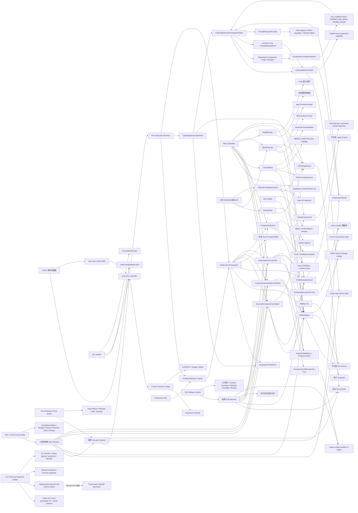

# Auto Slice 实现架构

## 组件图



## S01 数据流

```text
inspect-contracts(workspace_root)
  -> realpath + filesystem identity
  -> validate contracts/frozen-contracts.json schema and plugin ID
  -> strict UTF-8 read of CONTEXT, design, and four ADRs
  -> SHA-256 digests
  -> CONTRACTS_LOADED | CONTRACT_LOAD_FAILED
```

装载器只读，不修正文档；任一身份、schema、路径或编码错误都在进入 `PREPARING` 前闭合。

## S02 数据流

```text
create(initial RunState)
  -> 独占发布 event[0]
  -> 原子写 snapshot

compareAndSwap(run_id, expected_version, transition)
  -> 重放并校验 event chain + snapshot prefix
  -> 以 event[next_version] 的原子链接竞争 CAS
  -> 原子追平 snapshot
  -> StoredRun | stale_state | invalid_transition | state_corrupt

effect action
  -> appendEffectIntent(idempotency_key, payload_digest)
  -> 外部副作用（后续切片）
  -> completeEffect(idempotency_key, receipt_digest)
  -> recoverIncompleteEffects(run_id)
```

事件日志是权威状态，snapshot 只缓存已验证前缀；崩溃造成的落后前缀可重放追平，同版本不一致、校验和错误或事件断链进入只读诊断。

## S03 数据流

```text
acquire(workspace, run_id)
  -> 写不可变 lease locator
  -> 以 active locator 硬链接竞争唯一 Project Write Lease
  -> renew / freeze / rotate_epoch / release 追加不可变事件
  -> assertWritable(lease_id, epoch) 拒绝冻结、过期或旧 epoch capability

captureBaseline(workspace)
  -> 读取 HEAD、index、worktree 与 untracked 文件状态
  -> 固化 Protected Change 路径及内容 digest

classify(baseline, current, owned_paths)
  -> 基线脏文件有变化：protected_change_overlap
  -> 基线后新增且命中声明：OwnedPatch
  -> 基线后新增但未声明：按用户改动保护
```

租约事件是 epoch 与释放状态的权威记录；active locator 只表示当前占有者。锁持有者状态未知或租约过期时不自动抢占。Git 归属以整文件为最小保护单元，不做猜测性 hunk 分离。

## S04 数据流

```text
resolve(role, capabilities)
  -> 校验 role 是否存在冻结策略
  -> DETERMINISTIC: 直接返回 { mode: "none" }，不读取能力快照
  -> model role: 校验 snapshot source、captured_at、expires_at
  -> 精确匹配 gpt-5.6-sol 与 max / medium effort
  -> ModelDecision | model_policy_unavailable
```

Router 不调用模型、不探测网络，也不构造 provider request；Host Adapter 负责提供有来源且在显式有效期内的快照。任何相似模型、较低 effort、未知角色或不可信快照都 fail closed。

## S05 数据流

```text
start(contract, lease, model_decision)
  -> 解析 SliceContractV1，拒绝 shell 字符串与 workspace 外路径
  -> assertWritable(lease_id, write_epoch)
  -> 要求 DEVELOPMENT = gpt-5.6-sol/max
  -> 捕获 Protected Change 基线并签发 ExecutionId

collect(execution_id)
  -> 每个 check 前复核写租约
  -> argv + 限定 cwd + env allowlist 启动真实子进程
  -> digest stdout/stderr；超时或超量输出终止整棵进程树
  -> 捕获执行后 WorkspaceSnapshot 与 ExecutionReceipt digest

verify(contract, execution_receipt, workspace)
  -> 复核契约、回执 digest 和实时 WorkspaceSnapshot
  -> runner 结果优先于任何 LLM 文本
  -> 校验 artifact 存在性/内容 digest
  -> 独立调用时由 GitChangeGuard 证明 owned paths；Production 路径绑定 GitGoalCompletionGuard 回执
  -> PASS | 枚举 failure_code
```

执行与验收不 commit、不刷新 checkpoint；`VerificationReceipt` 是 S06/S11 的只读输入。进程输出只累计字节数与 SHA-256，不持久化无界文本；任一 check、artifact 或所有权失败都使整体验收为 FAIL。

## S06 数据流

```text
finishSlice(run, slice, verification, baseline, owned_patch, checkpoint_plan)
  -> 验证 VerificationReceipt digest/result 与 SliceContract 一致
  -> GitChangeGuard 重新捕获实时 workspace，证明 HEAD/OwnedPatch 未漂移
  -> effective_mode = slice.commit_mode_override ?? run.commit_mode

after_slice:
  -> 从 HEAD 创建隔离临时 index，只 add OwnedPatch.paths
  -> 校验 staged path 集与 blob/二进制 patch 等于已验证 OwnedPatch
  -> 再次核对 HEAD，运行本地 git commit hooks 并捕获 new HEAD
  -> 仅把 owned paths 对齐到新 HEAD，保留调用者原有 staged Protected Change
  -> flush + atomic rename SESSION_CHECKPOINT.md(new HEAD, next Slice)

none:
  -> 不 stage、不 commit，保留 OwnedPatch.patch_digest
  -> flush + atomic rename SESSION_CHECKPOINT.md(current HEAD, next Slice, diff digest)
```

Git 调用全部使用 argv 且没有 push 路径。hook/stage/HEAD 失败时不写 checkpoint；commit 已成功而 checkpoint 失败时返回真实新 HEAD，绝不 reset 已形成的提交。

这条 S06 组件路径保留为历史直接 API 与回归基线；Production composition 已由 ADR-0008 改为 Goal Task 自行收口、`GitGoalCompletionGuard` 只读观察，不再调用 `CommitCoordinator.finishSlice`。

## S07 数据流

```text
onEvent(AUTO_COMPACTION_STARTED, expected_version)
  -> 校验稳定 compaction_id、结构化 phase、有序 host_sequence 与 source_thread_id
  -> deadline_at = observed_at + 30s
  -> RunStore CAS: SLICE_RUNNING -> COMPACTION_WAIT(compaction_id, deadline_at)
  -> Clock 已逾期则立即 onDeadline；否则 Scheduler 按持久 deadline 挂 timer

onEvent(AUTO_COMPACTION_COMPLETED, expected_version)
  -> observed_at <= deadline_at: CAS -> SLICE_RUNNING，并清除 compaction
  -> observed_at > deadline_at: 复用 onDeadline，CAS -> SOURCE_INTERRUPTING

onDeadline(compaction_id, fired_at, expected_version)
  -> fired_at < deadline_at: 诊断 no-op 并重挂原 deadline
  -> fired_at >= deadline_at: CAS -> SOURCE_INTERRUPTING
  -> CAS loser 重读 RunStore，闭合为 completion_won | deadline_won no-op

recover(run_id, expected_version)
  -> 未到期 COMPACTION_WAIT: 重挂 timer
  -> 已到期 COMPACTION_WAIT: 立即提交 onDeadline
```

Monitor 只消费 Host 结构化信号；普通无输出、日志文案和模型自述不会创建 timer。`SOURCE_INTERRUPTING` 只作为 S07 输出状态，真实线程中断与写冻结由 S08 接手。

## S08 数据流

```text
interruptSource(run_id, lease_id, expected_write_epoch, expected_state_version)
  -> 要求 Run = SOURCE_INTERRUPTING，并核对 source_thread_id / compaction_id / lease owner
  -> FileWorkspaceGuard.freezeWrites：旧任务在 Host 回执前已不能写
  -> RunStore.appendEffectIntent(run/version/interrupt_source_thread/source_thread_id)
  -> ThreadControl.interrupt(thread_id, idempotency_key)，超时或调用失败即闭合
  -> 严格解码 InterruptReceipt(execution_stopped=true, thread_persisted=true)
  -> ThreadControl.inspect：独立核对 UUID、revision、可读、未归档、未删除
  -> RunStore.completeEffect(receipt_digest)
  -> FileWorkspaceGuard.rotateEpoch：旧 epoch 永久失效
  -> RunStore CAS: SOURCE_INTERRUPTING -> HANDOFF_EXPORTING(write_epoch + 1)

任一不可信回执或线程检查失败
  -> RunStore CAS: SOURCE_INTERRUPTING -> NEEDS_USER(source_interrupt_failed)
  -> lease 保持 FROZEN，不轮换 epoch，不进入 HANDOFF_EXPORTING
```

重复或并发调用使用同一 effect idempotency key；ThreadControl 只能形成一个中断副作用，RunStore CAS 只形成一个状态转换。若 Controller 在 epoch 已轮换但 Run 转换前崩溃，重启会从不可变 lease 事件和已完成 effect receipt digest 恢复，再补交唯一 CAS；不会再次中断或再次轮换。

## S09 数据流

```text
exportHandoff(run_id, interrupt_receipt, COMPRESSION decision, expected_version)
  -> 核对 HANDOFF_EXPORTING、Source UUID/revision、compaction_id 与 gpt-5.6-sol/medium
  -> RunStore CAS: HANDOFF_EXPORTING -> HANDOFF_EXPORTING
       action=mark_handoff_attempted，仅 false -> true，state_version + 1
  -> appendEffectIntent(export_handoff, compaction_id)
  -> CompressionTaskLauncher.start：新 UUID、同 workspace、空历史、无写租约
  -> awaitHandoff：只接受 v2 + 原子文件对 + verify-evidence PASS
  -> realpath 限定在 Source workspace，复算 Markdown/Evidence Index digest
  -> completeEffect(receipt_digest)
  -> RunStore CAS: HANDOFF_EXPORTING -> CONTINUATION_STARTING，并持久化 Handoff identity

任一任务/预算/来源/完整性失败
  -> NEEDS_USER(handoff_export_failed | handoff_integrity_failed)
  -> handoff_attempted 保持 true，保留 diagnostic/workDir，不自动创建第二个任务
```

同进程并发调用共享 in-flight promise；跨进程竞争由同态 CAS 与 launcher 的 idempotency key 收敛。Controller 在认领后或 effect 完成后崩溃时，可从 Run event/effect ledger 恢复；已进入 `NEEDS_USER` 的失败不会被自动重试。固定验收夹具把每个 MAP dispatch 放入独立 Node worker，协调器不读取私有 chunk 或 summary。

## S10 数据流

```text
continueFromHandoff(run_id, lease_id, HandoffReceipt, SliceContract, CONTINUATION decision)
  -> 要求 Run = CONTINUATION_STARTING，核对同一 run_id/current_slice_id
  -> 复算 Handoff receipt 与 Markdown/Evidence Index digest，限定同一 workspace
  -> ContinuationLauncher.start：第三个全新 UUID，gpt-5.6-sol/max，初始只读
  -> awaitReady：持久 rollout 证明先产出首份实质草案、零 pre-draft evidence read、无 broad search/full reread
  -> grant 前再次复验 Handoff；FileWorkspaceGuard 证明 S08 已轮换 epoch 仍有效
  -> grantWrite(task_id, write_epoch)，持久化 LeaseReceipt
  -> awaitProgress：只接受规范的 durable artifact digest 或 VerificationReceipt digest
  -> RunStore CAS: CONTINUATION_STARTING -> SLICE_RUNNING
       原子替换 source_thread_id，记录 continuation_task_id，清除已消费 compaction

任务、Ready、workspace、Handoff、grant 或 progress 任一失败
  -> NEEDS_USER(continuation_start_failed | handoff_integrity_failed | model_policy_unavailable)
  -> 保留 Handoff 与旧 Source 身份；旧 epoch 永久失效
  -> grant 可能已发生时重新冻结当前 epoch，阻止模糊失败后的迟到写
```

Controller 为 start+ready、grant 和 progress 分别写 effect intent/receipt；重复调用复核相同回执，只有 ProgressReceipt 成立才清除旧 compaction 门禁，因此普通 commentary 无法解锁下一次接力。

旧调用中的 `expected_owned_diff_digest` 仅条件式重建旧 Envelope 与 effect payload 以支持重放；新调用不生成该字段，ProgressReceipt 也不再与其比较。

## S11 控制面数据流

```text
execute(command, CommandEnvelope)
  -> 严格解析 command_id / run_id / expected_state_version / payload
  -> FileCommandJournal 原子认领 envelope digest；完成重放直接返回原回执
  -> status: 只读 FileRunStore，投影脱敏 RunSnapshot，不改变 Run version
  -> pause/resume/abort: 先取得安全点或撤销写能力，再以 expected version 提交唯一 CAS
  -> override: SlicePhase=PENDING 时只改变目标 Slice 的有效 commit mode；当前 Slice 投递后拒绝
  -> NEEDS_USER resume: 先按错误目录匹配 resolution 与 digest-bound evidence，再调用显式恢复端口
  -> 原子发布命令 completion；同 command_id 异构请求失败闭合
```

RunSnapshot 只显示任务 UUID、最近成功状态、错误码和白名单证据路径；不投影 `last_error.message` 或任意原始输出。命令回执账本与 Run 事件账本分离，status 的审计写入不改变 Run version。

文件运行时把 pause 映射为 lease 冻结，把 PAUSED resume 映射为 epoch 轮换，把 abort 映射为 lease 释放；非 abort 的 `NEEDS_USER` 恢复必须先复算 workspace 内证据文件 digest，随后才允许回到持久的 `last_successful_status`。

## S12 发布验收数据流

```text
verify-s12 --regenerate | verify-s12
  -> 校验 S12 inputs，并逐个复核 S01–S11 CompletionReceipt 的 contract/check/owned digest
  -> build + typecheck + 全量 test
  -> run-s12-e2e 两次：每次创建隔离本地 Git 仓库、FileRunStore、真实文件锁和持久任务记录
  -> 虚拟时钟重放 29.999/30 秒；真实协调器执行 Source -> Compression -> Continuation
  -> 机器断言 commit graph、checkpoint、Protected Change、Handoff digest、UUID、失败闭合与副作用计数
  -> 真实 export-codex-handoff verify-evidence helper smoke
  -> 两次规范化 JSON 必须字节等价
  -> Markdown links + plugin validation + lint
  -> 发布 10 份场景证据、E2E report、S01–S12 coverage、release checklist 和 S12 CompletionReceipt
```

Harness 只在系统临时目录写隔离仓库和任务状态；成功后清理，失败时保留路径用于诊断。它不配置 Git remote，不进入生产工作区，也不改变 S01–S11 控制器实现。S12 verifier 把未提交 S11 路径视为已验证前置层，只允许 S12 接管合同声明的共享文档与 `package.json`。

## S13 Production Plan 边界

```text
parseProductionPlanV1(raw, clock)
  -> 精确字段与 schema_version=1
  -> 每个嵌入 SliceContractV1 复用 S05 路径、argv 和 artifact 校验
  -> Slice id 唯一且顺序保持不变
  -> ModelRouter 同时证明 DEVELOPMENT/CONTINUATION=max、COMPRESSION=medium
  -> buildDevelopmentPrompt 只渲染 `设定goal：阅读checkpoint，实现<Slice>，完成后[commit，]刷新checkpoint`
  -> 契约与 instructions 保留为 Controller 数据，绝不进入任务 input
  -> ProductionPlanV1 + plan_digest + 三类精确 ModelDecision
```

本边界不启动 Codex、不取得写租约、不改变 Run 状态。Production Orchestrator 只消费规范化计划，并通过 `DevelopmentTaskPort` 接收可持久化线程身份与结构化 compaction 生命周期。

## S13 Production Orchestrator 数据流

```text
ProductionOrchestrator.run(resolved_plan)
  -> 读取匹配 plan_digest 的 PREPARING Run 与当前 Project Write Lease
  -> 从 plan_digest + slice_id 生成兼容 Slice binding，启动 DevelopmentTask
  -> PREPARING -> SLICE_RUNNING；下一 Slice 启动时同时轮换 current_slice_id + binding digest
  -> 消费结构化 compaction 事件，不读取 Git 或 workspace snapshot
  -> 普通完成：SLICE_RUNNING -> PREPARING(next Slice) | DONE(final Slice)
       -> 精确核对 Run/Slice/Thread/Turn、COMPLETED 与 receipt digest
       -> 生成 slice_id/source_thread_id/development_receipt_digest/state_version 最小回执
       -> 不调用 ChangeGuard、SliceExecutor、SliceVerifier 或 GitGoalCompletionGuard
       -> 下一 Slice，或释放租约并直接进入 DONE
  -> 压缩超时：SourceInterruption -> CompressionHandoff -> Continuation
       -> 只传递 Run/Slice/任务身份、持久 Source revision 与 Handoff Evidence
       -> 不调用 ChangeGuard，不生成或要求 owned diff digest
       -> 返回 CONTINUATION_STARTED；不提前 verify/commit，不释放新 write epoch
```

Orchestrator 只把 `DONE` 作为终态完成回执；`CONTINUATION_STARTED` 是持久接力确认，不代表当前 Slice 已完成。压缩超时由 `CompactionMonitor` 的持久状态转换证明，轮询只观察该状态，不用文本静默或模型自述推断。

`VERIFYING`、`COMMITTING`、`CHECKPOINTING` 仅保留 schema v1 解码、事件链重放、`status` 与 `abort`；普通 CAS、pause、resume 和 override 均不能让旧验收态继续推进。RunStore 以独立 replay 兼容谓词读取历史事件，不把历史迁移边界重新开放给新 Run。

## S13 生产文件入口数据流

```text
run-plan(plan_json_path, workspace_root, storage_root?)
  -> ProductionPlanV1 严格 UTF-8 JSON 解析与模型能力冻结
  -> workspace identity + workspace 外部默认状态目录
  -> ControlPlane.start 建立 PREPARING Run 与 Project Write Lease
  -> CodexAppServerTaskHost 启动持久 Development Task，并复用该适配器执行 Source interruption/inspect
  -> ProductionOrchestrator 顺序启动一句话 Goal Task，只核对结构化完成身份与枚举终态
  -> PRODUCTION_RUN_COMPLETED | PRODUCTION_CONTINUATION_STARTED | PRODUCTION_RUN_FAILED
```

默认 composition root 只实现 App Server Development Task、结构化完成推进与 Source Thread 控制；普通路径不构造或调用 Git/产物验收组件。Compression/Continuation launcher 必须由宿主显式注入；未注入时，压缩超时路径进入确定性失败闭合，不会伪造 Handoff 或扩大写权限。

## S13 发布验收数据流

```text
verify-s13 --regenerate | verify-s13
  -> 校验 S12 CompletionReceipt 与冻结设计输入 digest
  -> build + typecheck + 全量 test
  -> run-s13-production-entry 两次：每次创建无 remote 的临时 Git 仓库与外部状态目录
  -> 独立进程调用 runControllerCli + 默认 CodexAppServerTaskHost + fake App Server 协议
  -> 机器断言 DONE、commit_mode=none、HEAD/commit 数不变、remote/push=0
  -> 两次规范化报告字节等价
  -> Markdown links + plugin validation + lint
  -> 发布 entry report、release gate 与 S13 CompletionReceipt
```

Harness 成功后递归清理唯一临时根目录；它只把规范化断言写入 `artifacts/s13`，不把临时路径、模型输出或真实生产状态带入证据。

## S14 App Server 事件防火墙数据流

```text
initialize
  -> capabilities.optOutNotificationMethods 精确关闭 message/reasoning/command/diff/plan 内容通知

App Server notification
  -> CodexAppServerClient 有界 UTF-8 JSONL 解码
  -> HostEventFirewall.project(notification)
       contextCompaction -> 新建 COMPACTION DTO
       turn terminal -> 新建 TURN_TERMINAL DTO（忽略完整 items）
       thread lifecycle / model reroute -> 新建白名单 DTO
       agentMessage / reasoning / command output / diff / tool payload / plan -> DROP
  -> CodexAppServerDevelopmentTask 只消费 ControllerSignal
  -> DevelopmentTaskEvent | DevelopmentTaskReceipt（无 final_response_digest）
```

防火墙不透传、摘要、hash、记录或保留原始 notification；`pendingSignals` 只缓存已投影 DTO。短/大 Worker Content 搭配同一控制序列时，Development Task 事件与终态回执规范化后字节相同。Source persisted revision 仍保持 S13 路径，等待 S15 单独替换。

## S14 发布验收数据流

```text
verify-s14 --regenerate | verify-s14
  -> 校验 S13 CompletionReceipt、CONTEXT、ADR-0009 与冻结设计 digest
  -> build + typecheck + 目标测试 + 全量 test
  -> run-s14-firewall 两次：短/大内容、六类 canary、四种白名单 ControllerSignal
  -> 两个隔离 Production Run 复核规范化 Run 事件、终态回执与 Controller 状态目录
  -> 机器断言 opt-out 精确、正文 DROP、回执无正文 digest、控制与持久输出字节等价
  -> Markdown links + plugin validation + lint
  -> 发布 whitelist、canary、content-equivalence 与 S14 CompletionReceipt
```

## S15 Host 元数据 revision 数据流

```text
ThreadControl.interrupt(source_thread_id)
  -> turn/interrupt + 结构化 INTERRUPTED 终态
  -> ThreadRevisionProvider.read(thread_id)
       64-byte URL-safe opaque token -> InterruptReceipt.persisted_revision
       UNAVAILABLE / provider failure -> thread_revision_unavailable
       非法长度或字符 -> thread_revision_invalid

ThreadControl.inspect(source_thread_id)
  -> ThreadMetadataPort.inspect(thread_id, includeTurns=false)
  -> thread/read 只接收持久 Thread summary；发现任意 turns/items 即拒绝
  -> ThreadRevisionProvider.read(thread_id)
  -> ThreadInspection(summary + independently observed revision)

SourceInterruptionCoordinator
  -> 分别验证 InterruptReceipt 与 ThreadInspection 的 opaque revision
  -> 两次 token 相同：完成 effect、轮换 epoch、进入 HANDOFF_EXPORTING
  -> unavailable / invalid / mismatch：NEEDS_USER(source_interrupt_failed)
       lease 保持 FROZEN，不创建 Compression Task
```

默认 App Server Host 没有稳定原生 revision 能力，因此组合根显式使用 fail-closed provider；测试或未来 Host 只能注入已满足定长不透明契约的 provider。Controller 不从 `updatedAt` 推导 revision，也不读取、hash 或保留完整 turns。

## S15 发布验收数据流

```text
verify-s15 --regenerate | verify-s15
  -> 校验 S14/S08/S09 CompletionReceipt、CONTEXT、ADR-0009 与冻结设计 digest
  -> build + typecheck + App Server/Source interruption/Handoff 目标测试 + 全量 test
  -> run-s15-metadata-revision 两次：真实 adapter、RunStore、lease 与 coordinator
  -> 机器断言 64-byte token、unavailable/invalid/mismatch、恶意 turns/items 与零 full-turn read
  -> 失败场景保持 FROZEN + NEEDS_USER 且 Compression dispatch 为零
  -> Markdown links + plugin validation + lint
  -> 发布 capability matrix、protocol trace、Handoff gate 与 S15 CompletionReceipt
```

## S16 / S-ACC-1 最终端到端门禁

```text
verify-s16 --regenerate | verify-s16
  -> 校验 S15/S14/S13 CompletionReceipt、最终 CONTEXT/ADR/设计 digest
  -> build + typecheck + Production/App Server/RunStore/Control/Skill 目标测试 + 全量 test
  -> run-s16-content-budget 两次，每次执行八个隔离 run-plan 场景：
       两刀可信完成 short / large（after_slice、零 commit、零 checkpoint、额外文件）
       29.999 秒 compaction completed
       30 秒 timeout + revision available / unavailable
       Host capability UNAVAILABLE + 20 分钟 probe fallback
       Worker FAILED / INTERRUPTED
  -> fake Host 注入 message/reasoning/command/diff/tool/plan/summary/error 八类 canary
  -> HostEventFirewall 只重建四类 ControllerSignal，并逐条校验 canonical JSON <= 8 KiB
  -> 比较 short/large 的规范化 Run snapshot、effect ledger、终态回执、Run event 字节与状态目录大小
  -> 子进程 PATH 注入失败即记录的 Git trap，普通与压缩路径调用数必须为零
  -> 证明 V1 owned_paths/checks/expected_artifacts 存在但惰性；旧验收态由 RunStore/Control 目标测试锁定
  -> 事件能力 AVAILABLE 时 probe=0；UNAVAILABLE 时只产生一个 20 分钟枚举 probe
  -> 扫描 workspace 外 Controller 状态目录、harness stdout/stderr、错误投影和全部规范化回执
  -> revision available 保持 Source/Compression/Continuation 三 UUID；unavailable 在 Handoff 前进入 NEEDS_USER
  -> Markdown links + plugin validation + lint
  -> 发布 acceptance matrix、content budget、canary、revision/failure trace 与 S16 CompletionReceipt
```

Harness 的 Worker Content 只存在于隔离 fake App Server 或 probe 私有变量；进入 Controller 的信号、状态、effect、回执与进程输出均按原始字节扫描。成功场景删除临时根目录；首个违反点保留唯一隔离现场且不回显 canary 内容。S-ACC-1 只扩展验收组件，不改变 Production Orchestrator、30 秒阈值或 Handoff v2 语义。

## S-PROBE-1 分段压缩正文探测

```text
Host capability = AVAILABLE
  -> 只消费 contextCompaction STARTED/COMPLETED
  -> CompactionContentProbePort 调用数恒为 0

Host capability = UNAVAILABLE
  -> Turn start 后挂 20m deadline
  -> NO_COMPACTION: 30m -> 35m -> 40m -> 42m -> 每 2m
  -> 同一时刻最多一个 probe in-flight；错过的旧 slot 不补读
  -> COMPACTION_SEEN: 只重建 AUTO_COMPACTION_STARTED 枚举事件
       -> 复用 S07 的 30 秒 deadline 与 S08–S10 三任务接力
  -> PROBE_FAILED/非法 DTO: compaction_probe_failed -> NEEDS_USER
  -> 结构化事件、Turn 终态或 dispose: 取消 timer，迟到结果按 generation 丢弃
```

Probe 可在端口内部读取 Worker Content，但返回值只允许封闭枚举、规范时间和白名单失败码。Development Task 以本地单调事件序号投影 probe/Host 信号；若已探测到压缩后 Turn 在 30 秒内结束，则先投影匹配的 `AUTO_COMPACTION_COMPLETED` 再关闭事件队列，避免 Run 留在 `COMPACTION_WAIT`。

## S17 App Server 0.146.0 schema 投影

```text
verify-s17
  -> 无 shell 解析 Codex CLI 入口，要求 codex-cli 0.146.0
  -> 临时目录运行 generate-ts + generate-json-schema
  -> 记录完整 TS/JSON corpus 的文件数与原始字节 digest
  -> 只提取 thread/start/read、skills/list、turn/start、item/turn notification 所需字段
  -> 对比 checked-in minimal projection digest
  -> build + typecheck + 目标/全量测试 + lint + plugin + Markdown + diff check
  -> 发布 schema-projection-report + CompletionReceipt

future S18–S21 App Server path
  -> app-server-protocol-v2 fail-closed decode
  -> thread sandbox 使用 kebab-case；Turn SandboxPolicy 使用 camelCase
  -> text_elements 与 workspaceWrite 五字段按生成 TypeScript 全部显式发送
  -> skills/list 只接受唯一 enabled canonical match
  -> fresh root 只接受 persistent + parentless + unforked + turns=[]
  -> selected command/agent/tool item 或 terminal Turn；未知 required variant 拒绝
```

S17 模块尚未接入既有 Development Task 或 Controller state；它只建立后续生命周期迁移的协议事实层，因此不会改变 S14–S16 运行路径。JSON Schema 中的默认值仍被记录用于漂移诊断，但发送方必填性以本机生成 TypeScript 为准。

## 决策反向索引

- Controller 与单工作区边界：[ADR-0001](adr/0001-local-controller-and-task-isolation.md)
- 后续模型策略边界：[ADR-0002](adr/0002-deterministic-model-routing.md)
- 历史提交与 checkpoint 顺序：[ADR-0003](adr/0003-commit-and-checkpoint-order.md)
- 一句话 Goal Task 与任务侧收口：[ADR-0008](adr/0008-goal-task-input-and-finish-ownership.md)
- 后续压缩接力边界：[ADR-0004](adr/0004-compaction-timeout-handoff.md)
- S02 目录式事件存储：[ADR-0005](adr/0005-directory-event-store.md)
- S03 租约独占与 epoch 日志：[ADR-0006](adr/0006-project-write-lease-log.md)
- S08 中断顺序与三任务隔离：[ADR-0001](adr/0001-local-controller-and-task-isolation.md)、[ADR-0004](adr/0004-compaction-timeout-handoff.md)
- S09 Compression Task 隔离与单次 Handoff：[ADR-0001](adr/0001-local-controller-and-task-isolation.md)、[ADR-0002](adr/0002-deterministic-model-routing.md)、[ADR-0004](adr/0004-compaction-timeout-handoff.md)
- S10 Continuation 只读启动、write epoch 接管与进展门禁：[ADR-0001](adr/0001-local-controller-and-task-isolation.md)、[ADR-0002](adr/0002-deterministic-model-routing.md)、[ADR-0004](adr/0004-compaction-timeout-handoff.md)、[ADR-0006](adr/0006-project-write-lease-log.md)
- S11 命令重放、显式恢复与脱敏状态投影：[`docs/implementation-slices.md` §13](implementation-slices.md)
- S12 真实验收夹具、十场景矩阵与人工试运行门禁：[`docs/implementation-slices.md` §14](implementation-slices.md)
- S13 Production Plan、App Server 适配器、文件入口与生产编排：`src/controller/production/plan-parser.ts`、`src/controller/production/codex-app-server-development-task.ts`、`src/controller/production/file-production-runtime.ts`、`src/controller/production/production-cli.ts`、`src/controller/production/production-orchestrator.ts`
- S13 隔离生产入口验收：`scripts/run-s13-production-entry.mjs`、`scripts/verify-s13.mjs`、`contracts/slices/S13.json`
- S14 内容盲事件投影与正文 DROP：[ADR-0009](adr/0009-content-blind-controller.md)、`src/controller/production/app-server-client.ts`、`contracts/slices/S14.json`
- S15 Host opaque revision 与 summary-only inspection：[ADR-0009](adr/0009-content-blind-controller.md)、`src/controller/production/codex-app-server-development-task.ts`、`contracts/slices/S15.json`
- S16 / S-ACC-1 可信完成、失败闭合、probe 降级、兼容矩阵与内容预算门禁：[ADR-0009](adr/0009-content-blind-controller.md)、[ADR-0010](adr/0010-trusted-worker-completion.md)、`scripts/run-s16-content-budget.mjs`、`scripts/verify-s16.mjs`、`contracts/slices/S16.json`
- S17 App Server 0.146.0 最小投影与 schema 事实层：[ADR-0011](adr/0011-export-owned-revision-and-fresh-task-launchers.md)、[三任务接力切片方案](切片方案-App-Server三任务接力解锁.md)、`src/controller/production/app-server-protocol-v2.ts`、`scripts/verify-s17.mjs`、`contracts/slices/S17.json`
- S-PROBE-1 显式 Host capability、分段调度与枚举隔离：[ADR-0009 §2](adr/0009-content-blind-controller.md)、`src/controller/compaction-monitor/probe-schedule.ts`、`src/controller/production/codex-app-server-development-task.ts`
