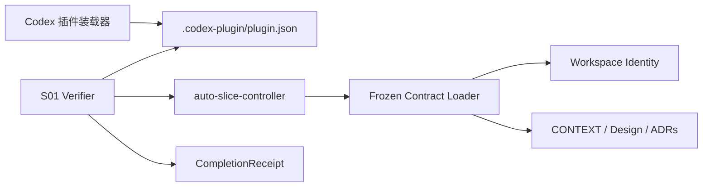

# Auto Slice 实现架构

## 组件图



## S01 数据流

```text
inspect-contracts(workspace_root)
  -> realpath + filesystem identity
  -> validate contracts/frozen-contracts.json schema and plugin ID
  -> strict UTF-8 read of CONTEXT, design, and four ADRs
  -> SHA-256 digests
  -> CONTRACTS_LOADED | CONTRACT_LOAD_FAILED
```

装载器只读，不修正文档；任一身份、schema、路径或编码错误都在进入 `PREPARING` 前闭合。

## 决策反向索引

- Controller 与单工作区边界：[ADR-0001](adr/0001-local-controller-and-task-isolation.md)
- 后续模型策略边界：[ADR-0002](adr/0002-deterministic-model-routing.md)
- 后续提交与 checkpoint 顺序：[ADR-0003](adr/0003-commit-and-checkpoint-order.md)
- 后续压缩接力边界：[ADR-0004](adr/0004-compaction-timeout-handoff.md)
