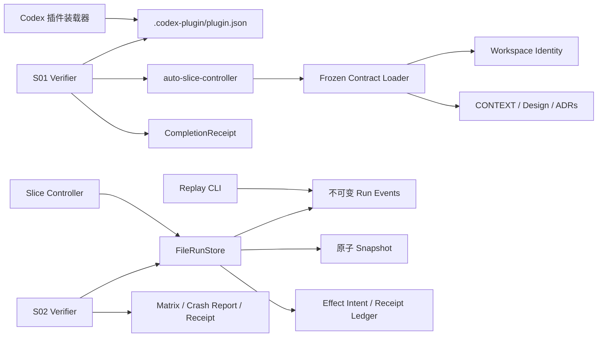

# Auto Slice 实现架构

## 组件图



## S01 数据流

```text
inspect-contracts(workspace_root)
  -> realpath + filesystem identity
  -> validate contracts/frozen-contracts.json schema and plugin ID
  -> strict UTF-8 read of CONTEXT, design, and four ADRs
  -> SHA-256 digests
  -> CONTRACTS_LOADED | CONTRACT_LOAD_FAILED
```

装载器只读，不修正文档；任一身份、schema、路径或编码错误都在进入 `PREPARING` 前闭合。

## S02 数据流

```text
create(initial RunState)
  -> 独占发布 event[0]
  -> 原子写 snapshot

compareAndSwap(run_id, expected_version, transition)
  -> 重放并校验 event chain + snapshot prefix
  -> 以 event[next_version] 的原子链接竞争 CAS
  -> 原子追平 snapshot
  -> StoredRun | stale_state | invalid_transition | state_corrupt

effect action
  -> appendEffectIntent(idempotency_key, payload_digest)
  -> 外部副作用（后续切片）
  -> completeEffect(idempotency_key, receipt_digest)
  -> recoverIncompleteEffects(run_id)
```

事件日志是权威状态，snapshot 只缓存已验证前缀；崩溃造成的落后前缀可重放追平，同版本不一致、校验和错误或事件断链进入只读诊断。

## 决策反向索引

- Controller 与单工作区边界：[ADR-0001](adr/0001-local-controller-and-task-isolation.md)
- 后续模型策略边界：[ADR-0002](adr/0002-deterministic-model-routing.md)
- 后续提交与 checkpoint 顺序：[ADR-0003](adr/0003-commit-and-checkpoint-order.md)
- 后续压缩接力边界：[ADR-0004](adr/0004-compaction-timeout-handoff.md)
- S02 目录式事件存储：[ADR-0005](adr/0005-directory-event-store.md)
