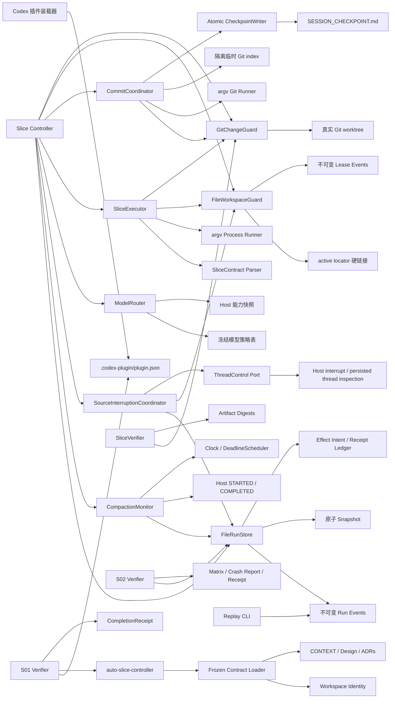

# Auto Slice 实现架构

## 组件图



## S01 数据流

```text
inspect-contracts(workspace_root)
  -> realpath + filesystem identity
  -> validate contracts/frozen-contracts.json schema and plugin ID
  -> strict UTF-8 read of CONTEXT, design, and four ADRs
  -> SHA-256 digests
  -> CONTRACTS_LOADED | CONTRACT_LOAD_FAILED
```

装载器只读，不修正文档；任一身份、schema、路径或编码错误都在进入 `PREPARING` 前闭合。

## S02 数据流

```text
create(initial RunState)
  -> 独占发布 event[0]
  -> 原子写 snapshot

compareAndSwap(run_id, expected_version, transition)
  -> 重放并校验 event chain + snapshot prefix
  -> 以 event[next_version] 的原子链接竞争 CAS
  -> 原子追平 snapshot
  -> StoredRun | stale_state | invalid_transition | state_corrupt

effect action
  -> appendEffectIntent(idempotency_key, payload_digest)
  -> 外部副作用（后续切片）
  -> completeEffect(idempotency_key, receipt_digest)
  -> recoverIncompleteEffects(run_id)
```

事件日志是权威状态，snapshot 只缓存已验证前缀；崩溃造成的落后前缀可重放追平，同版本不一致、校验和错误或事件断链进入只读诊断。

## S03 数据流

```text
acquire(workspace, run_id)
  -> 写不可变 lease locator
  -> 以 active locator 硬链接竞争唯一 Project Write Lease
  -> renew / freeze / rotate_epoch / release 追加不可变事件
  -> assertWritable(lease_id, epoch) 拒绝冻结、过期或旧 epoch capability

captureBaseline(workspace)
  -> 读取 HEAD、index、worktree 与 untracked 文件状态
  -> 固化 Protected Change 路径及内容 digest

classify(baseline, current, owned_paths)
  -> 基线脏文件有变化：protected_change_overlap
  -> 基线后新增且命中声明：OwnedPatch
  -> 基线后新增但未声明：按用户改动保护
```

租约事件是 epoch 与释放状态的权威记录；active locator 只表示当前占有者。锁持有者状态未知或租约过期时不自动抢占。Git 归属以整文件为最小保护单元，不做猜测性 hunk 分离。

## S04 数据流

```text
resolve(role, capabilities)
  -> 校验 role 是否存在冻结策略
  -> DETERMINISTIC: 直接返回 { mode: "none" }，不读取能力快照
  -> model role: 校验 snapshot source、captured_at、expires_at
  -> 精确匹配 gpt-5.6-sol 与 max / medium effort
  -> ModelDecision | model_policy_unavailable
```

Router 不调用模型、不探测网络，也不构造 provider request；Host Adapter 负责提供有来源且在显式有效期内的快照。任何相似模型、较低 effort、未知角色或不可信快照都 fail closed。

## S05 数据流

```text
start(contract, lease, model_decision)
  -> 解析 SliceContractV1，拒绝 shell 字符串与 workspace 外路径
  -> assertWritable(lease_id, write_epoch)
  -> 要求 DEVELOPMENT = gpt-5.6-sol/max
  -> 捕获 Protected Change 基线并签发 ExecutionId

collect(execution_id)
  -> 每个 check 前复核写租约
  -> argv + 限定 cwd + env allowlist 启动真实子进程
  -> digest stdout/stderr；超时或超量输出终止整棵进程树
  -> 捕获执行后 WorkspaceSnapshot 与 ExecutionReceipt digest

verify(contract, execution_receipt, workspace)
  -> 复核契约、回执 digest 和实时 WorkspaceSnapshot
  -> runner 结果优先于任何 LLM 文本
  -> 校验 artifact 存在性/内容 digest
  -> GitChangeGuard 证明改动全在 owned paths
  -> PASS | 枚举 failure_code
```

执行与验收不 commit、不刷新 checkpoint；`VerificationReceipt` 是 S06/S11 的只读输入。进程输出只累计字节数与 SHA-256，不持久化无界文本；任一 check、artifact 或所有权失败都使整体验收为 FAIL。

## S06 数据流

```text
finishSlice(run, slice, verification, baseline, owned_patch, checkpoint_plan)
  -> 验证 VerificationReceipt digest/result 与 SliceContract 一致
  -> GitChangeGuard 重新捕获实时 workspace，证明 HEAD/OwnedPatch 未漂移
  -> effective_mode = slice.commit_mode_override ?? run.commit_mode

after_slice:
  -> 从 HEAD 创建隔离临时 index，只 add OwnedPatch.paths
  -> 校验 staged path 集与 blob/二进制 patch 等于已验证 OwnedPatch
  -> 再次核对 HEAD，运行本地 git commit hooks 并捕获 new HEAD
  -> 仅把 owned paths 对齐到新 HEAD，保留调用者原有 staged Protected Change
  -> flush + atomic rename SESSION_CHECKPOINT.md(new HEAD, next Slice)

none:
  -> 不 stage、不 commit，保留 OwnedPatch.patch_digest
  -> flush + atomic rename SESSION_CHECKPOINT.md(current HEAD, next Slice, diff digest)
```

Git 调用全部使用 argv 且没有 push 路径。hook/stage/HEAD 失败时不写 checkpoint；commit 已成功而 checkpoint 失败时返回真实新 HEAD，绝不 reset 已形成的提交。

## S07 数据流

```text
onEvent(AUTO_COMPACTION_STARTED, expected_version)
  -> 校验稳定 compaction_id、结构化 phase、有序 host_sequence 与 source_thread_id
  -> deadline_at = observed_at + 30s
  -> RunStore CAS: SLICE_RUNNING -> COMPACTION_WAIT(compaction_id, deadline_at)
  -> Clock 已逾期则立即 onDeadline；否则 Scheduler 按持久 deadline 挂 timer

onEvent(AUTO_COMPACTION_COMPLETED, expected_version)
  -> observed_at <= deadline_at: CAS -> SLICE_RUNNING，并清除 compaction
  -> observed_at > deadline_at: 复用 onDeadline，CAS -> SOURCE_INTERRUPTING

onDeadline(compaction_id, fired_at, expected_version)
  -> fired_at < deadline_at: 诊断 no-op 并重挂原 deadline
  -> fired_at >= deadline_at: CAS -> SOURCE_INTERRUPTING
  -> CAS loser 重读 RunStore，闭合为 completion_won | deadline_won no-op

recover(run_id, expected_version)
  -> 未到期 COMPACTION_WAIT: 重挂 timer
  -> 已到期 COMPACTION_WAIT: 立即提交 onDeadline
```

Monitor 只消费 Host 结构化信号；普通无输出、日志文案和模型自述不会创建 timer。`SOURCE_INTERRUPTING` 只作为 S07 输出状态，真实线程中断与写冻结由 S08 接手。

## S08 数据流

```text
interruptSource(run_id, lease_id, expected_write_epoch, expected_state_version)
  -> 要求 Run = SOURCE_INTERRUPTING，并核对 source_thread_id / compaction_id / lease owner
  -> FileWorkspaceGuard.freezeWrites：旧任务在 Host 回执前已不能写
  -> RunStore.appendEffectIntent(run/version/interrupt_source_thread/source_thread_id)
  -> ThreadControl.interrupt(thread_id, idempotency_key)，超时或调用失败即闭合
  -> 严格解码 InterruptReceipt(execution_stopped=true, thread_persisted=true)
  -> ThreadControl.inspect：独立核对 UUID、revision、可读、未归档、未删除
  -> RunStore.completeEffect(receipt_digest)
  -> FileWorkspaceGuard.rotateEpoch：旧 epoch 永久失效
  -> RunStore CAS: SOURCE_INTERRUPTING -> HANDOFF_EXPORTING(write_epoch + 1)

任一不可信回执或线程检查失败
  -> RunStore CAS: SOURCE_INTERRUPTING -> NEEDS_USER(source_interrupt_failed)
  -> lease 保持 FROZEN，不轮换 epoch，不进入 HANDOFF_EXPORTING
```

重复或并发调用使用同一 effect idempotency key；ThreadControl 只能形成一个中断副作用，RunStore CAS 只形成一个状态转换。若 Controller 在 epoch 已轮换但 Run 转换前崩溃，重启会从不可变 lease 事件和已完成 effect receipt digest 恢复，再补交唯一 CAS；不会再次中断或再次轮换。

## 决策反向索引

- Controller 与单工作区边界：[ADR-0001](adr/0001-local-controller-and-task-isolation.md)
- 后续模型策略边界：[ADR-0002](adr/0002-deterministic-model-routing.md)
- 后续提交与 checkpoint 顺序：[ADR-0003](adr/0003-commit-and-checkpoint-order.md)
- 后续压缩接力边界：[ADR-0004](adr/0004-compaction-timeout-handoff.md)
- S02 目录式事件存储：[ADR-0005](adr/0005-directory-event-store.md)
- S03 租约独占与 epoch 日志：[ADR-0006](adr/0006-project-write-lease-log.md)
- S08 中断顺序与三任务隔离：[ADR-0001](adr/0001-local-controller-and-task-isolation.md)、[ADR-0004](adr/0004-compaction-timeout-handoff.md)
