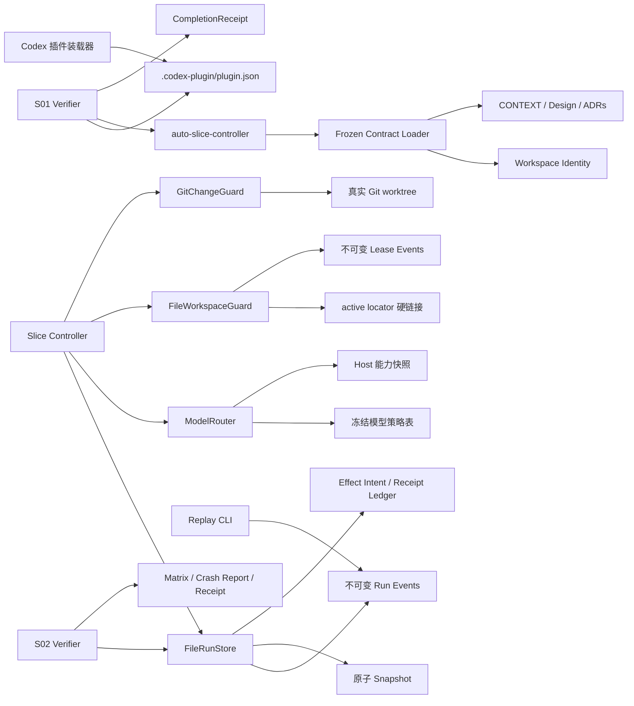

# Auto Slice 实现架构

## 组件图



## S01 数据流

```text
inspect-contracts(workspace_root)
  -> realpath + filesystem identity
  -> validate contracts/frozen-contracts.json schema and plugin ID
  -> strict UTF-8 read of CONTEXT, design, and four ADRs
  -> SHA-256 digests
  -> CONTRACTS_LOADED | CONTRACT_LOAD_FAILED
```

装载器只读，不修正文档；任一身份、schema、路径或编码错误都在进入 `PREPARING` 前闭合。

## S02 数据流

```text
create(initial RunState)
  -> 独占发布 event[0]
  -> 原子写 snapshot

compareAndSwap(run_id, expected_version, transition)
  -> 重放并校验 event chain + snapshot prefix
  -> 以 event[next_version] 的原子链接竞争 CAS
  -> 原子追平 snapshot
  -> StoredRun | stale_state | invalid_transition | state_corrupt

effect action
  -> appendEffectIntent(idempotency_key, payload_digest)
  -> 外部副作用（后续切片）
  -> completeEffect(idempotency_key, receipt_digest)
  -> recoverIncompleteEffects(run_id)
```

事件日志是权威状态，snapshot 只缓存已验证前缀；崩溃造成的落后前缀可重放追平，同版本不一致、校验和错误或事件断链进入只读诊断。

## S03 数据流

```text
acquire(workspace, run_id)
  -> 写不可变 lease locator
  -> 以 active locator 硬链接竞争唯一 Project Write Lease
  -> renew / freeze / rotate_epoch / release 追加不可变事件
  -> assertWritable(lease_id, epoch) 拒绝冻结、过期或旧 epoch capability

captureBaseline(workspace)
  -> 读取 HEAD、index、worktree 与 untracked 文件状态
  -> 固化 Protected Change 路径及内容 digest

classify(baseline, current, owned_paths)
  -> 基线脏文件有变化：protected_change_overlap
  -> 基线后新增且命中声明：OwnedPatch
  -> 基线后新增但未声明：按用户改动保护
```

租约事件是 epoch 与释放状态的权威记录；active locator 只表示当前占有者。锁持有者状态未知或租约过期时不自动抢占。Git 归属以整文件为最小保护单元，不做猜测性 hunk 分离。

## S04 数据流

```text
resolve(role, capabilities)
  -> 校验 role 是否存在冻结策略
  -> DETERMINISTIC: 直接返回 { mode: "none" }，不读取能力快照
  -> model role: 校验 snapshot source、captured_at、expires_at
  -> 精确匹配 gpt-5.6-sol 与 max / medium effort
  -> ModelDecision | model_policy_unavailable
```

Router 不调用模型、不探测网络，也不构造 provider request；Host Adapter 负责提供有来源且在显式有效期内的快照。任何相似模型、较低 effort、未知角色或不可信快照都 fail closed。

## 决策反向索引

- Controller 与单工作区边界：[ADR-0001](adr/0001-local-controller-and-task-isolation.md)
- 后续模型策略边界：[ADR-0002](adr/0002-deterministic-model-routing.md)
- 后续提交与 checkpoint 顺序：[ADR-0003](adr/0003-commit-and-checkpoint-order.md)
- 后续压缩接力边界：[ADR-0004](adr/0004-compaction-timeout-handoff.md)
- S02 目录式事件存储：[ADR-0005](adr/0005-directory-event-store.md)
- S03 租约独占与 epoch 日志：[ADR-0006](adr/0006-project-write-lease-log.md)
